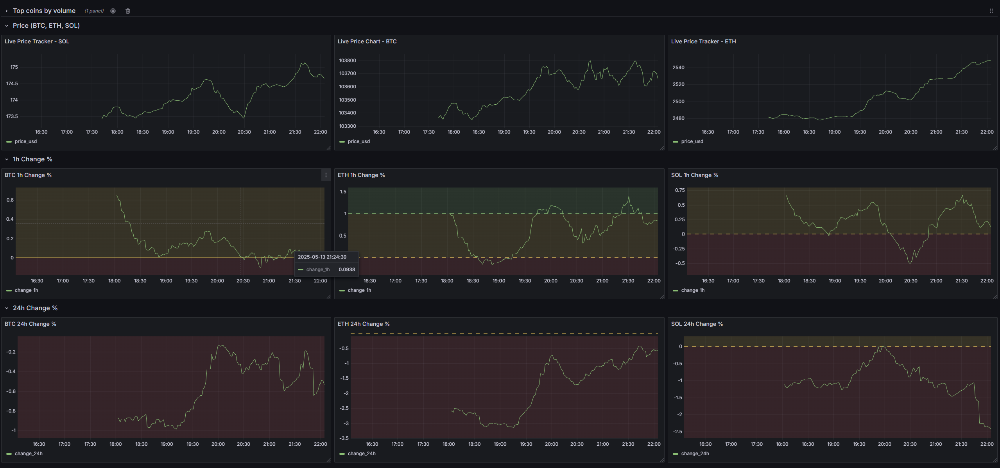
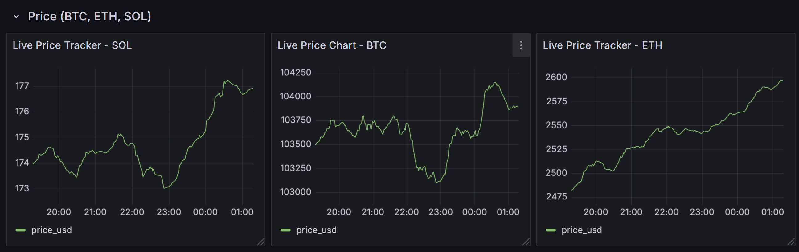
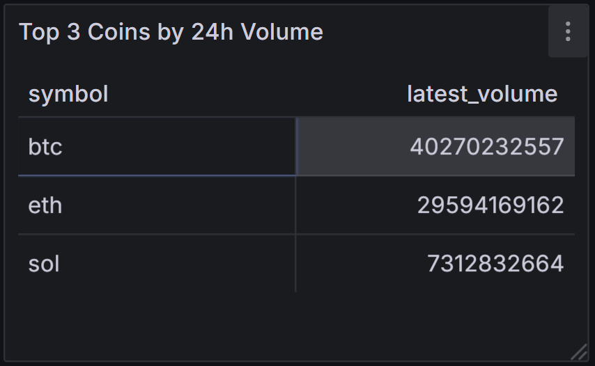
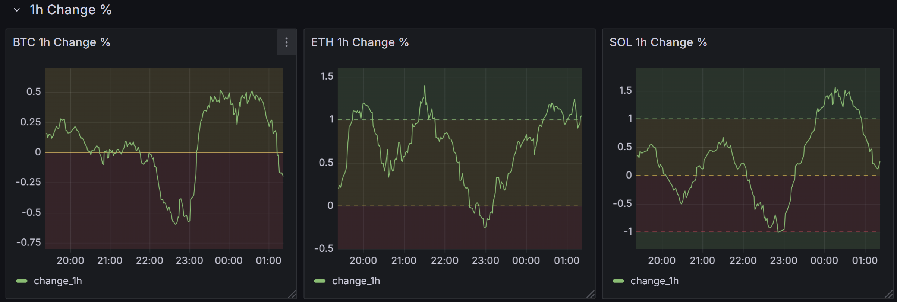
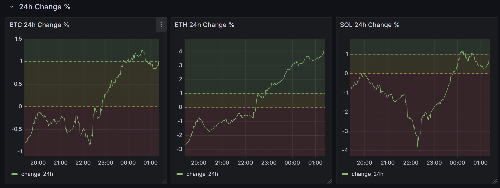

# Real-Time Crypto ETL Pipeline with Kafka, PostgreSQL & Grafana

A real-time data pipeline that streams live cryptocurrency market data from the CoinGecko API into Apache Kafka, processes it using Python, stores it in PostgreSQL, and visualizes price trends using Grafana.



---

## Tech Stack

- **Apache Kafka** – Real-time message streaming
- **Python** – Kafka producer/consumer, REST API polling
- **PostgreSQL** – Persistent storage of crypto data
- **Grafana** – Live visualization dashboard
- **pgAdmin** – GUI for managing PostgreSQL
- **Docker Compose** – Multi-service orchestration

---

## Features

- ✅ Real-time crypto price ingestion (Bitcoin, Ethereum, Solana)
- ✅ Filters out redundant data (only sends to Kafka if price changes)
- ✅ Stores historical data in PostgreSQL
- ✅ Interactive time-series dashboards in Grafana
- ✅ Fully containerized setup with Docker Compose
- ✅ Persisted dashboards, databases, and admin panels across restarts

---

## Folder Structure

kafka-crypto-etl/
├── kafka_app/ # Producer and consumer scripts
├── config/ # DB and Kafka configs
├── db/ # SQL table definitions
├── dashboards/ # Grafana/Superset notes (optional)
├── docker-compose.yml
├── requirements.txt
├── .env # (optional: API keys or config vars)
└── README.md

---

## How to Run

### 1. Clone the Repo

```bash
git clone https://github.com/your-username/kafka-crypto-etl.git
cd kafka-crypto-etl

```

### 2. Start Docker Stack

```bash
docker-compose up -d

```

This starts up:
- Kafka & Zookeeper
- PostgreSQL & pgAdmin
- Grafana

### 3. Set Up PostgreSQL Table

Access pgAdmin at [http://localhost:8080](http://localhost:8080)(login: admin@admin/admin), and run:

```sql
CREATE TABLE IF NOT EXISTS crypto_prices (
  id SERIAL PRIMARY KEY,
  symbol VARCHAR(10),
  name VARCHAR(50),
  price_usd NUMERIC,
  market_cap NUMERIC,
  volume NUMERIC,
  timestamp TIMESTAMP
  change_1h NUMERIC,
  change_24h NUMERIC,
);
```

### 4. Run the Producer and Consumer

```bash
# Terminal 1
python -m kafka_app.producer

# Terminal 2
python -m kafka_app.consumer
```

---

## Grafana Setup

1. Access Grafana at [http://localhost:3000](http://localhost:3000) (admin / admin)
2. Add PostgreSQL data source:
- Host: postgres, Port: 5432
- DB: crypto_db, User: admin, Password: admin
3. Create dashboard with this SQL:

```sql
SELECT timestamp AS time, <price_usd/change_1h/change_24h>
FROM crypto_prices
WHERE symbol = '<symbol for the cryptocurrencies>' AND $__timeFilter(timestamp)
ORDER BY timestamp
```

---

## Sample Dashboard Panels
- Live BTC/ETH/SOL Price Chart



- Top Coin by 24h Volume


- 1h Change %


- 24h Change %


---

## Maintainer
Hong Xun
www.linkedin.com/in/onghongxun
https://github.com/HXong/HXong